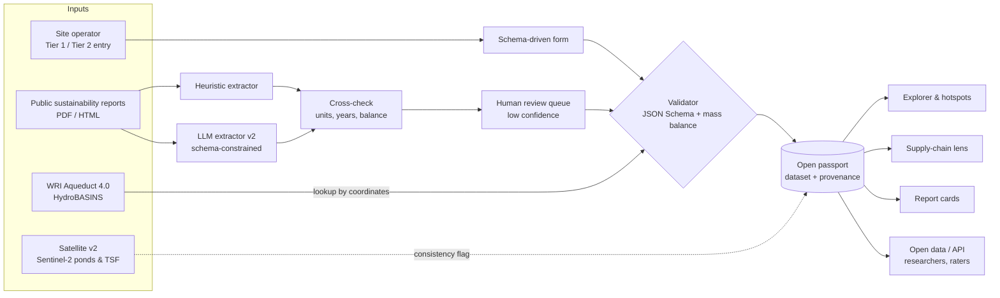

# MineWater Passport — Challenge 2: Reporting on Water Use by Mining Actors

EIT Water Hackathon Munich 2026 · Challenge owner: Dr. F. Stephan Lutter, WU Vienna · Folder contents: `framework/` (standard + JSON Schema), `prototype/` (offline web app), `data/` (synthetic dataset + validator), `docs/` (screenshots), `PITCH.md`.

> **Honesty note.** Every mine, operator and number in `data/` and in the prototype is **illustrative synthetic data** (fictional sites, labelled in the UI). Real-world facts in this dossier are cited in §14. Numbers marked *assumption* are our estimates.

---

## 1. TL;DR

**One-liner:** *A one-page, open, machine-readable "water passport" for every mine — 12 must-report numbers, a checked water balance and basin context — plus the tool that fills it (from site data or from existing reports) and turns it into comparable, decision-ready answers.*

**Pitch paragraph:** The energy transition needs more copper, lithium, nickel and cobalt, and new mines will increasingly sit in water-stressed basins. Yet nobody can say which mine uses how much water, because reporting is voluntary, aggregated at company level and mixes up withdrawal with consumption. MineWater Passport fixes the data unit: a **site-level minimum standard** (built on ICMM 2021 and the MCA Water Accounting Framework, mapped field-by-field to GRI 303/GRI 14, ESRS E3, CDP and IRMA), a **validator** that checks the mass balance and scores transparency A–E, an **explorer** that ranks hotspots (high consumption × high basin stress) and gives battery buyers a per-tonne water footprint, and a **report extractor** that backfills passports from today's sustainability reports. Researchers get an open, comparable dataset; buyers get due-diligence evidence for the EU Batteries Regulation; basin authorities see who uses what.

## 2. The challenge

- **Owner:** Dipl.-Ing. Dr. F. Stephan Lutter, Institute for Ecological Economics, WU Vienna University of Economics and Business. Research on environmental/water accounting, material flows and mining (FINEPRINT brief on Chilean copper water use; 2025 work using machine learning + Earth observation on global copper water use; co-author of *Metal mining is a global driver of environmental change*, Nat. Rev. Earth Environ. 2025) — see §14.
- **Title:** Reporting on Water Use by Mining Actors (Climate-Resilient Watersheds & Infrastructure).
- **Verbatim problem statement:** *"Mines compete with agriculture, local communities and ecosystems for limited water resources. To answer questions like who is using how much water, what impacts arise, which uses should be prioritised, and whether metal supply can keep pace under growing scarcity, detailed site-level water-use data is essential. Today, reporting by mining and production sites is limited, patchy, heterogeneous and inconsistent—due to missing obligations, poor understanding of on-site water cycles and a lack of water-accounting capacity."*
- **Explicit ask:** rethink **data, indicators and reporting frameworks** for **transparent, comparable, decision-relevant** water-use reporting that enables **ESG assessment, due diligence and low-impact supply chains**. Context: clean-energy transition needs metals, recycling alone is insufficient, new mines are needed, climate change increases scarcity.

## 3. Problem framing

**Root causes (why reporting is patchy)**

| Root cause | Symptom in reports | What it breaks |
|---|---|---|
| Voluntary, overlapping regimes (GRI, CDP, ICMM, IRMA, national rules) | Different templates, boundaries, units | Comparability |
| Company-level aggregation | One number for 20+ sites in different basins | Basin impact, site ranking, supply modelling |
| Withdrawal vs consumption confusion; "water used" | Same word for very different flows | Intensities differ by up to an order of magnitude |
| Water quality ignored | Seawater, hypersaline dewatering, brine lumped with freshwater | Brine-lithium and desal-fed copper mis-ranked |
| Poor understanding of on-site water cycles (ICMM/WAF not applied) | Balance does not close; storage, entrainment, evaporation unknown | Plausibility, trust |
| Lack of water-accounting capacity at smaller operators | Estimates presented as facts | Data quality |
| No basin context | Totals without stress, seasonality, competing users | Decision relevance ("which uses should be prioritised?") |

**Who is affected:** communities and farmers competing for water; ecosystems (wetlands, salars, springs); basin authorities; investors and ESG analysts; OEM / battery due-diligence teams; researchers building global datasets (the owner's own work reports that copper's global water intensity is about two-fold higher than previously known — a symptom of missing site data).

**Why now (stated accurately)**

- **EU Batteries Regulation (EU) 2023/1542** — battery due-diligence policies (Art. 47–48) for cobalt, lithium, natural graphite and nickel; Annex X lists water-related environmental risks. Application postponed to **18 Aug 2027** by Regulation (EU) 2025/1561 — buyers have ~2 years to build evidence systems.
- **Critical Raw Materials Act (EU) 2024/1252** — strategic projects must be implemented sustainably, incl. monitoring, prevention and minimisation of environmental impacts (Art. 6(1)(c)); lithium projects in Europe (Portugal, Serbia, Austria, …) will face water scrutiny.
- **CSRD / ESRS E3** — E3-4 requires water consumption, consumption in areas at water risk, recycling and storage (company level, value-chain relevant). ESRS simplification is ongoing — site-level data remains the input either way.
- **GRI 14: Mining Sector 2024** (effective 1 Jan 2026) — asks mining companies to report withdrawal, discharge and consumption **by mine site**. The format for that is missing: we propose it.
- **Climate change** — more frequent droughts in Chile, Peru, Southern Europe; mines compete harder with agriculture and drinking water.

## 4. Users & personas + journey

| Persona | Job to be done | Pain today | Gain with MWP |
|---|---|---|---|
| **Dr. Lena K., raw-materials due-diligence lead at an EU cell maker** | Show auditors a risk-based battery due-diligence policy covering water for Li/Ni/Co suppliers | Supplier water data = PDFs, company totals, no basin context; 3–6 weeks per supplier questionnaire (*assumption*) | Per-site passport, water per t LCE by quality, stress, red flags, sourcing-mix simulation — in minutes |
| **Tomás R., environmental superintendent at a mid-size copper mine** | Answer GRI, CDP, customer and regulator requests | 5+ different questionnaires, no water accountant | Fill 12 Tier-1 fields once; validator checks balance; one JSON answers all crosswalked frameworks |
| **Researcher (like the challenge owner) / basin authority analyst** | Build global, comparable site-level water datasets; allocate water in a basin | Hand-extraction from heterogeneous reports; inconsistent definitions | Open schema + open dataset + extraction pipeline with provenance and confidence flags |

**Journey — Lena (buyer)**

| Step | Today | With MineWater Passport |
|---|---|---|
| 1. Identify supplier sites | Supplier names only; sites unclear | Passport list by commodity with coordinates |
| 2. Get water data | Questionnaire, chase for weeks | Passport already published or backfilled from reports (flagged "automated, unreviewed") |
| 3. Understand risk | Company totals, no stress context | Map + hotspot view: consumption × basin stress, seasonality, grievances |
| 4. Compare suppliers | Apples vs oranges (withdrawal vs consumption, brine vs freshwater) | Normalised m³/t LCE by WAF quality category, same allocation rules |
| 5. Decide & document | Narrative memo | Sourcing-mix simulator + printable report card → audit file |

## 5. Solution iterations

| # | Concept | Description |
|---|---|---|
| A | **Pure policy proposal** | White paper recommending mandatory site-level disclosure in EU law |
| B | **Satellite-based estimation** | Estimate mine water use from evaporation-pond and TSF extents (Sentinel-2) + climate data |
| C | **LLM report-mining database** | Crawl sustainability reports, extract water figures into a database |
| D | **Standard + tool** | Minimum site-level schema + entry/validation tool + explorer |
| **E** | **D + C (+ B as verification in iteration 2)** — *chosen* | Standard as the data unit, tool for reporters and users, extraction to backfill, satellite as independent check |

**Scoring (1–5)**

| Concept | Impact | Feasibility | Alignment (EIT Water) | Demo-ability | Total |
|---|---|---|---|---|---|
| A Policy only | 3 | 4 | 3 | 1 | 11 |
| B Satellite only | 4 | 2 (needs calibration data that doesn't exist yet) | 4 | 3 | 13 |
| C LLM database only | 3 (garbage in, garbage out: inconsistent definitions) | 4 | 3 | 4 | 14 |
| D Standard + tool | 4 | 4 | 4 | 4 | 16 |
| **E Standard + tool + extraction (+ satellite v2)** | **5** | **4** | **5** | **5** | **19** |

**Why E wins:** extraction without a standard reproduces today's inconsistency; a standard without backfill starts from zero data; satellites need ground-truth to calibrate — which the passports provide. E creates the data unit, fills it fast, and later verifies it.

**Iteration 2 would change:** (1) live Aqueduct 4.0 + HydroBASINS lookup from coordinates; (2) LLM extraction (schema-constrained JSON with page citations) cross-checked by the deterministic parser and the mass balance; (3) satellite verification layer — pond/TSF water-surface area from Sentinel-2 over the Maus et al. mining polygons, evaporation estimate vs reported consumption → "consistency flag"; (4) basin view: sum of passports vs basin availability (WRI/HydroBASINS) to support prioritisation.

## 6. Chosen solution

**Features**

1. **Standard** (`framework/`): Tier 1 (12 data points) and Tier 2 (full WAF balance), WAF quality categories, per-figure data-quality flag, assurance, context; JSON Schema with `x-mwp` crosswalk annotations → GRI 303/14, ESRS E3, CDP, IRMA, ICMM, WAF.
2. **Validator**: JSON-Schema conformance + mass balance (W − D − C − ΔS ≈ 0, ±5 % illustrative tolerance) + component sums; A–E transparency score.
3. **Explorer**: map (colour = basin stress, size = consumption or withdrawal), comparison table with normalised KPIs, hotspot ranking.
4. **Supply-chain lens**: per-commodity water footprint per t metal/LCE with economic allocation, split by water quality, sourcing-mix simulator, screening flags tied to the Batteries Regulation / CRMA.
5. **Report card**: printable A–E card per site.
6. **Report extractor**: heuristic extraction from report prose (units → ML, year, prior-year and intensity detection, ambiguity flags) → draft passport → validator.

**Architecture**



**Data model** (see `framework/mine-water-passport.schema.json`): `site` (ID, coordinates, commodity, mine type, processing route, lifecycle, basin{stress}) · `period` · `production` (ore t or brine m³, products[] {commodity, metal t, basis contained/LCE, allocation share}) · `water` (withdrawals[] {source, subtype, quality, freshwater_gri, volume_ml, dq}, discharges[], consumption {total + components, dq}, storage, reuse, OMW, monthly[]) · `context` (competing users, seasonality, grievances, incidents) · `assurance` · `sources[]` (with extraction provenance).

**Algorithms**

- *Mass balance:* residual = Σ withdrawals − Σ discharges − consumption − (closing − opening storage); flag if |residual| / withdrawal > 5 %.
- *Intensities:* m³/t ore = ML × 1000 / t; m³/t metal = consumption × 1000 × allocation share / t contained (LCE for lithium).
- *Stress weighting (illustrative):* low 0.1, low-medium 0.3, medium-high 0.5, high 0.8, extremely high / arid 1.0. Hotspot = stress ≥ high **and** consumption ≥ 3,000 ML/yr (demo threshold).
- *Transparency score:* Tier-1 completeness 24 + Tier-2 depth 20 + volume-weighted data quality 30 + assurance 16 + balance closure 10 → A ≥ 90, B ≥ 75, C ≥ 58, D ≥ 45, E < 45.
- *Extractor:* sentence split → number+unit regex (GL, ML, megalitres, m³, million m³, Mm³, thousand m³, litres; EN and EU number formats) → nearest preceding keyword (withdraw/abstract/intake, consum, discharg/returned, recycl/reuse; "used" = ambiguous) → skip intensities ("per tonne") and prior-year comparatives ("(2022: …)") → percentage shares mapped to sources → confidence high/medium/low → draft passport + balance check.

## 7. Prototype

**What is built (all offline, no server, no build step)**

| Path | Content |
|---|---|
| `prototype/index.html` | 7-tab app: Explorer · Hotspots · Supply-chain lens · Report card · Enter & validate · Report extractor · The standard |
| `prototype/js/` | `validator.js` (JSON-Schema subset), `metrics.js` (KPIs, balance, score, flags), `form.js` (schema-driven form), `extractor.js`, `app.js` |
| `prototype/vendor/` | Leaflet 1.9.4, Chart.js 4.5.1, Natural Earth 1:50m countries (via world-atlas) — vendored from npm |
| `data/sites.json`, `data/sites_kpis.csv` | 17 synthetic passports (Chile/Peru/Argentina Cu & Li, Australia Li/Ni/Cu, Sweden/Finland, Austria/Portugal/Serbia Li projects, DRC Cu-Co, Spain, Indonesia HPAL) |
| `data/generate_synthetic.py`, `data/validate.py` | Deterministic generator; validator (full `jsonschema`, Draft 2020-12) + balance check |
| `framework/` | Standard (markdown), JSON Schema, crosswalk, two example passports |
| `scripts/screenshots.py`, `docs/*.png` | Playwright render of every view; report-card PDF example |

**Run on Windows**

1. Double-click `prototype\index.html` (Chrome/Edge). Nothing else needed.
2. Optional — validate data:
   ```
   cd 02-mining-water-reporting
   python -m venv .venv
   .venv\Scripts\activate
   pip install -r requirements.txt
   python data\validate.py
   python data\validate.py framework\example-passport.tier1.json
   ```
3. Optional — regenerate data: `python data\generate_synthetic.py` (rewrites `data/` and `prototype/data/`).

**Verification done:** `python data/validate.py` → 17/17 passports pass the schema, 2 sites intentionally show an open balance (Kalemba, Lufira). Playwright (`scripts/screenshots.py`) renders all views via `file://` with **zero console errors/warnings and zero failed requests**; screenshots in `docs/`.

**90-second demo script (click by click)**

| t | Click | Say |
|---|---|---|
| 0:00 | Tab **1 Explorer** | "17 mines — fictional, but realistic — each reporting one MineWater Passport. Colour is basin stress, size is water consumed." |
| 0:12 | Toggle **Size: withdrawal** | "Watch Norrberg in Sweden: one of the biggest withdrawers… (toggle back) …but a small consumer — most of its water is rain returned to the river. Today's reports don't separate these. We do." |
| 0:25 | Tab **2 Hotspots** | "Top-right: high consumption in high-stress basins. This is where regulators, buyers and researchers should look first." |
| 0:35 | Tab **3 Supply-chain lens → Lithium** | "A battery buyer compares water per tonne of LCE. Right chart: brine sites withdraw mostly hypersaline Cat-3 water — one 'litres per tonne' number would hide that." Drag a slider: "sourcing mix updates live." |
| 0:50 | Tab **4 Report card**, pick *Lufira Cobalt* | "Grade E: estimates, no assurance, and the balance is off by more than 5 %. Printable, one page, for the audit file." |
| 1:02 | Tab **5 Enter & validate** → *New blank* | "A mine fills 12 fields. Validation and mass balance run as you type; the JSON answers GRI, ESRS, CDP and IRMA at once." |
| 1:15 | Tab **6 Report extractor → Sample 3** | "And to backfill thousands of sites: paste a report. 'The project *used* 3,800 megalitres' — flagged ambiguous. That's the core problem, detected automatically." Click **Open in passport form**. |
| 1:28 | — | "Standard, tool, extraction. Pilot with WU Vienna: 50 sites in 90 days." |

## 8. Impact logic

| Inputs | Activities | Outputs | Outcomes | Impact |
|---|---|---|---|---|
| Open schema, validator, extractor; WU Vienna research data; public reports; pilot sites | Backfill passports from reports; onboard mines for Tier 1/2; publish open dataset; buyer screening | Comparable site-level passports with quality flags; hotspot maps; report cards | Buyers shift offtake / engagement to lower-impact sites; mines improve metering & recycling; basin authorities allocate with data; research models become site-based | Less consumption in stressed basins, fewer water conflicts, metal supply that is climate-resilient — protecting ecosystems and communities |

**KPIs (targets are assumptions)**

| KPI | Pilot (90 days) | Year 2 |
|---|---|---|
| Sites with a passport | 50 (backfilled) | 1,000+ (backfilled + self-reported) |
| Share with closed balance (±5 %) | measure baseline | +30 pp vs baseline |
| Share of volume "measured" | measure baseline | +20 pp |
| Extraction precision on water figures (vs manual) | ≥ 85 % on high-confidence items | ≥ 95 % with LLM + cross-check |
| Buyer time per supplier water assessment | –50 % | –80 % |
| Global copper/lithium production covered by passports | 5–10 % | 40 % |

## 9. Business model & path to pilot

- **Open core:** schema, validator, crosswalk and basic dataset are **open (CC-BY / MIT)** — adoption is the moat; researchers and NGOs use it **free**.
- **Who pays:**
  - *Due-diligence SaaS* for OEMs, cell makers, traders: supplier screening, sourcing-mix, audit exports, alerts. Pricing hypothesis €15–40k per buyer / year (*assumption*).
  - *Data licensing* to ESG rating agencies, index providers, banks (enriched, reviewed, time-series dataset): €30–100k / year (*assumption*).
  - *Mines:* free Tier-1 filing; paid Tier-2 water-accounting assistant & assurance-ready exports for mid-tier miners (€5–15k / site / year, *assumption*).
- **90-day pilot with WU Vienna (challenge owner)**

| Weeks | Work | Deliverable |
|---|---|---|
| 1–2 | Co-define Tier-1 fields and allocation rules with WU; pick 50 sites (Cu + Li, incl. Chilean sites with public national statistics as reference) | Schema v0.2 |
| 3–6 | Backfill 50 sites from public reports (heuristic + LLM + manual review), provenance on every figure | 50 passports |
| 7–9 | **Inter-comparability test**: two independent coders per site; compare extracted vs manual; compare with WU's EO-based estimates; measure balance closure and definition conflicts | Comparability report |
| 10–12 | Share with 2–3 buyers and 1 basin authority; feedback on usefulness; publish dataset & paper draft | Open dataset v1, pilot report |

## 10. Feasibility, risks & mitigations

| Risk | Likelihood | Mitigation |
|---|---|---|
| Mines don't report voluntarily | High | Backfill from existing reports; pull via buyers (Batteries Reg.) and GRI 14 site-level ask; Tier 1 is small |
| Definitions contested (quality categories, allocation) | Medium | Reuse ICMM/WAF/GRI definitions; publish allocation; governance with ICMM/IRMA/academia |
| Extraction errors | Medium | Confidence flags, deterministic cross-check, mass balance, human review, provenance label on every figure |
| Scores seen as "naming and shaming" | Medium | Score measures reporting quality, not performance; right to reply; mines can upgrade by reporting |
| Basin stress data coarse for arid endorheic basins | Medium | Aqueduct "arid & low water use" treated as high; add local hydrology in pilot; satellite layer v2 |
| Commercial data competitors | Medium | Open standard + academic stewardship = neutrality; paid layer is convenience, not access |

## 11. Pitch (3 minutes, word-for-word)

See `PITCH.md` (identical script + 7-slide outline).

## 12. Jury Q&A prep

1. **"Isn't this just another reporting standard?"** — No new definitions: we use ICMM 2021, the MCA WAF and GRI 303. What's new is the *site-level minimum set*, the quality/context flags and the machine-readable crosswalk so one passport answers GRI, ESRS, CDP and IRMA. It reduces reporting, it doesn't add to it.
2. **"Why would a mine fill it in?"** — Buyers need it for battery due diligence from Aug 2027; GRI 14 already asks for site-level figures; and we backfill from their own reports, so the choice becomes "correct your passport" rather than "start from zero".
3. **"Your data are fake."** — Yes, deliberately labelled synthetic. The pilot backfills 50 real sites from public reports with WU Vienna; the pipeline and validator are real and running.
4. **"Withdrawal vs consumption — why does it matter?"** — In our demo two sites withdraw ~27–28 GL; one consumes 6 GL, the other 26 GL. Only consumption is lost to the basin; only the quality split tells you whether it was freshwater.
5. **"How do you handle brine lithium?"** — We classify brine as groundwater, WAF Category 3 (hypersaline); we report it separately from freshwater and show both per t LCE — the fair comparison buyers need.
6. **"Why not just satellites?"** — Satellites see ponds and tailings, not pipes, bores and desal. They're our verification layer in iteration 2 and need passports as ground truth.
7. **"Is the A–E score arbitrary?"** — It's transparent and published; weights are a proposal to be calibrated in the pilot. It rates reporting quality, not water performance.
8. **"Who owns the standard?"** — Proposed academic stewardship (e.g. WU Vienna) with an advisory group of industry, civil society and standard setters; open licence.
9. **"How is this relevant to Central & Alpine Europe?"** — Europe's own lithium projects (Portugal, Serbia, Austria in our demo as fictional analogues) and EU buyers importing metals; EU regulation (Batteries Reg., CRMA, CSRD) is the lever that makes global mines report.
10. **"Business model if everything is open?"** — Open data unit; paid due-diligence workflow for buyers and enriched, reviewed time-series for raters and banks. Researchers free.

## 13. Build-on-the-day plan (11:45–16:15)

| Role | Sprint I (11:45–13:30) | Sprint II (14:15–16:15) |
|---|---|---|
| **Lead / pitch** (our hacker) | Problem framing & persona validation with owner; confirm Tier-1 list | Demo script, deck, rehearse |
| **Data / research** | Pick 3 real public reports (copper, lithium); manual extraction as ground truth | Run extractor, compare, write "precision" slide (label as small sample) |
| **Front-end dev** | Add "real vs synthetic" toggle for the 3 backfilled real sites (with citations) | Polish, projector check at 1920×1080 |
| **Domain / ESG** | Validate crosswalk with owner; check allocation rule | Business model & pilot plan slide |
| **Optional 5th: GIS** | Add Aqueduct lookup from a small offline sample CSV | Satellite-verification mock for one site |

**If Wi-Fi fails:** everything runs from `prototype/index.html` offline (vendored libs, offline basemap); validator runs locally with Python; screenshots in `docs/` and `docs/report-card-example.pdf` as backup; PITCH.md printable.

## 14. References

- F. Stephan Lutter — WU Vienna profile: https://research.wu.ac.at/en/persons/f-stephan-lutter/ ; institute page: https://www.wu.ac.at/en/ecolecon/institute/team/slutter
- Lutter, S., Maus, V., Luckeneder, S., Tost, M. (2025). *Increasing Water Use in Global Copper Production Threatens Freshwater Availability.* Ecological Economic Papers 49/2025, WU Vienna. https://research.wu.ac.at/en/publications/increasing-water-use-in-global-copper-production-threatens-freshw/
- Lutter, S., Giljum, S. (2019). *Copper production in Chile requires 500 million cubic metres of water.* FINEPRINT Brief No. 9. https://fineprint.resource-use.global/publications/briefs/chile-copper-water/
- Giljum, S., Maus, V., et al. (2025). *Metal mining is a global driver of environmental change.* Nature Reviews Earth & Environment. https://www.nature.com/articles/s43017-025-00683-w
- Maus, V., et al. (2022). *An update on global mining land use.* Scientific Data 9. https://www.nature.com/articles/s41597-022-01547-4
- ICMM (2021). *Water Reporting: Good Practice Guide (2nd edition).* https://www.icmm.com/en-gb/guidance/environmental-stewardship/2021/water-reporting
- Minerals Council of Australia (2022). *Minerals Industry Water Accounting Framework — User Guide v2.0.* https://minerals.org.au/wp-content/uploads/2022/12/MCA-Water-Accounting-Framework-User-Guide-2.0-2022.pdf
- GRI 303: Water and Effluents 2018. https://www.globalreporting.org/publications/documents/english/gri-303-water-and-effluents-2018
- GRI 14: Mining Sector 2024. https://www.globalreporting.org/standards/standards-development/sector-standard-for-mining/
- ESRS E3 Water and marine resources (Delegated Regulation (EU) 2023/2772, Annex I). https://www.efrag.org/sites/default/files/media/document/2024-08/ESRS%20E3%20Delegated-act-2023-5303-annex-1_en.pdf
- CDP Full Corporate Questionnaire 2024 — Modules 8–13 guidance (module 9 water). https://cdn.cdp.net/cdp-production/comfy/cms/files/files/000/009/102/original/CDP_2024_Corporate_Questionnaire_Guidance_Modules_8-13.pdf
- IRMA Standard for Responsible Mining v1.0 — Chapter 4.2 Water Management. https://responsiblemining.net/wp-content/uploads/2018/08/Chapter_4.2_Water_Management.pdf
- Regulation (EU) 2023/1542 (Batteries Regulation). https://eur-lex.europa.eu/eli/reg/2023/1542/oj/eng
- Council of the EU (2025). "Stop-the-clock" on battery due-diligence rules (Regulation (EU) 2025/1561). https://www.consilium.europa.eu/en/press/press-releases/2025/07/18/simplification-council-adopts-law-to-stop-the-clock-on-due-diligence-rules-for-batteries/
- Regulation (EU) 2024/1252 (Critical Raw Materials Act). https://eur-lex.europa.eu/eli/reg/2024/1252/oj
- European Commission — Strategic projects under the CRMA. https://single-market-economy.ec.europa.eu/sectors/raw-materials/areas-specific-interest/critical-raw-materials/strategic-projects-under-crma_en
- WRI (2023). *Aqueduct 4.0: Updated Decision-Relevant Global Water Risk Indicators.* https://www.wri.org/research/aqueduct-40-updated-decision-relevant-global-water-risk-indicators
- Natural Earth (public-domain basemap, via world-atlas npm package). https://www.naturalearthdata.com/
